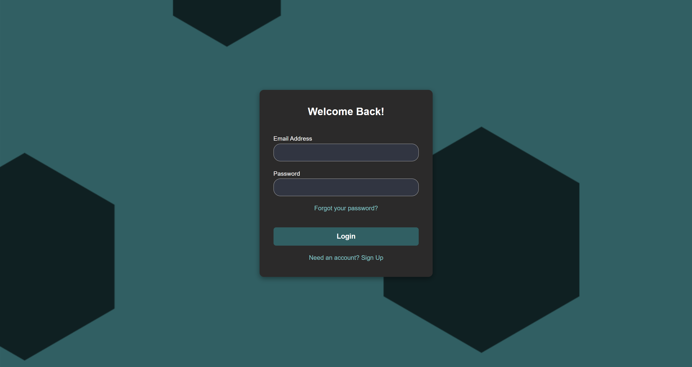

# 🕋 Umrah Tour

*Umrah Tour* is a modern web application designed to help Muslims plan a smooth and personalized Umrah journey. It uses AI to generate smart itineraries based on user input such as travel dates, budget, City, and preferences for transportation and historical sites.

---

## ⚙️ Installation Guide

Follow these steps to set up the project on your machine:

### Setup

1. **Install dependencies**
   ```bash
   npm install
   ```

2. **Install required libraries**
   ```bash
   npm install react-router-dom react-markdown
   ```

---

### AI Server Setup

1. **Install [Ollama](https://ollama.com/download)** on your local machine.

2. **Run the llama 3 model**
   ```bash
   ollama run llama3:8b
   ```

3. **Install Python dependencies**
   Make sure you have Python installed, then run:
   ```bash
   pip install fastapi uvicorn requests
   ```

---

## 🚀 Running the Project

### 1. Start the React App
in the root folder run:
```bash
npm run dev
```

### 2. Start the AI Server
Navigate to the AI-Server folder and run:
```bash
python -m uvicorn ollama_server:app --reload
```

---

##  Features

- 📆 Plan your Umrah trip step by step  
- 🤖 AI-generated itinerary via FastAPI + Ollama   
- 🔐 Login/Logout functionality with Firebase

---

## 🖼 UI Screenshots

A visual walkthrough of the *Umrah Tour* web app:

### 🔐 1. Authentication Page


### 🏠 2. Home Page


### 🗓 3. Plan Tab (Multi-step)

- **Step 1: Travel Date**  
  

- **Step 2: Transportation & Budget Preferences**  
  

- **Step 3: Additional Details**  
  

### 📋 4. Your Saved Plan


### 🕋 5. Umrah Guide
  


---